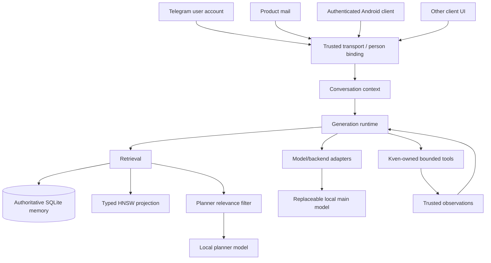

# Kven II

**Kven II is a persistent local-AI engineering assistant: one continuing agent designed to preserve technical context, decision history, relationships, operational evidence, unfinished work, and causal history across time and across different client/transport interfaces.**

The practical goal is straightforward: help engineers investigate systems, correlate evidence, reason about incidents, document decisions, and carry unfinished work forward without depending on one person's memory as the only place where critical operational knowledge exists.

Kven II is **not** intended to replace an infrastructure engineer or to make autonomous production authority desirable. It is intended to preserve and organize engineering context so that decisions remain explainable, evidence can be revisited, and knowledge can be handed to the next engineer instead of disappearing with the person who currently carries it.

This repository is a **selected, sanitized public projection** of the working project. It contains representative source, tests, and architecture notes, but deliberately excludes the private production/control plane, runtime state, credentials, host-specific configuration, private evidence, and operational deployment mechanics.

## What already works

The following capabilities are implemented and backed by accepted project evidence:

- **Transport-independent continuity.** Kven is not a collection of unrelated chat sessions. Different transports enter the same continuing agent and durable context.
- **Telegram user-account transport.** A real Telegram user-account path is part of the accepted system; private contacts, identifiers, and live configuration are not published here.
- **Product mail as a cognition transport.** Mail can carry ordinary interaction and engineering evidence into the same Kven continuity model without making mailbox configuration part of the public surface.
- **Authenticated external Android client.** The accepted Android vertical slice proved a physical authenticated client path, reconnect/retry behavior, and continuity with knowledge established through another transport.
- **Canonical person binding.** Trusted transport principals can resolve to one canonical person identity. Caller-supplied text is not treated as authority to claim identity.
- **Cross-transport relation and memory continuity.** A person can reach the same Kven relationship and durable memory through different accepted interfaces rather than creating a new artificial persona per client.
- **Durable memory and typed retrieval.** Episodic and semantic memory remain authoritative in SQLite; vector search is a rebuildable projection with typed identity and bounded reranking.
- **Trusted native-tool provenance.** A tool result becomes a trusted observation only through a Kven-owned execution boundary; protocol-shaped client or model text cannot promote itself into evidence.
- **Fresh verification of mutable state.** Operational facts that may have changed are re-checked through trusted observations instead of being presented as current merely because they exist in memory.
- **Replaceable model backends.** Kven's agent architecture is kept separate from backend-specific model behavior through explicit adapters and boundaries. Backend replacement is an implementation concern, not a new person or a new memory universe.

These are product/architecture claims, not a claim that every private subsystem is reproduced in this public repository.

## Why continuity matters in engineering work

Many operational failures are not caused by a lack of raw information. They happen because relevant observations, decisions, exceptions, partial investigations, and historical reasons are scattered across people, chats, tickets, mail, consoles, and memory.

Kven II treats continuity as engineering state. The system is intended to retain enough provenance to answer questions such as:

- What did we already verify, and from which source?
- Which fact is current, and which is only remembered history?
- Why was a previous decision made?
- Which hypotheses were ruled out during an incident?
- What work was left unfinished, and what evidence should the next engineer inherit?
- Is this the same person continuing through a different trusted transport?

That makes the continuity problem broader than "chat history". It includes identity, memory, provenance, retrieval, context ownership, tools, and explicit boundaries around authority.

## Where the project is going

### Infrastructure Steward — accepted architecture / planned implementation

The next major professional direction is **Infrastructure Steward**, a first-class infrastructure domain vertical over the same Kven core. Its architecture is accepted; it is **not presented as a completed production feature**.

The accepted direction includes:

- **INFRA as a typed, provenance-preserving derived projection**, not source truth;
- **read-only-first collectors** that normalize observations before cognition;
- **fresh-state and drift correlation** instead of treating remembered infrastructure state as current;
- **durable incident workspaces** that preserve symptoms, hypotheses, evidence, discriminating tests, actions, and causal resolution;
- **bounded change workspaces** with pre-checks, rollback, explicit human authority boundaries, post-checks, and evidence;
- **documentation generated from accepted state plus source evidence**, so topology, inventory, handoffs, and change records are views of the same evidence-backed state;
- a **backend-neutral asynchronous Deep Worker** for difficult bounded reasoning. It has no independent person identity, no durable person memory, and no direct production authority.

The intent is to make long-lived infrastructure knowledge more transferable and auditable while keeping source evidence, human authority, and current-state verification explicit.

## The underlying research question

Kven II also remains a local-AI research project about continuity. It does **not** claim that current language models are conscious. The narrower engineering question is:

> What architecture is required for a capable local model to behave as one continuing system rather than a sequence of isolated inference calls?

A model call can supply intelligence for a moment. Kven's surrounding system is responsible for the state that must survive that call: identity, relationship, memory, evidence, context, unfinished work, and the rules that decide what may be trusted later.

## What is technically distinctive

Kven II treats several problems that are often implemented as unrelated features as parts of one continuity problem:

- **Unified durable memory.** Episodic and semantic memory remain authoritative in SQLite; vector search is a rebuildable projection rather than the source of truth.
- **Typed vector identity.** HNSW labels are mapped back to typed memory references so episodic and semantic rows cannot silently collide.
- **Explicit embedding-space contracts.** The accepted retrieval generation uses **Qwen3-Embedding-8B**, 4096-dimensional normalized embeddings, with distinct query/document roles.
- **Planner reranking.** Approximate vector recall is followed by a small-model relevance filter with a strict output protocol and fail-closed parsing.
- **Token-aware context ownership.** Conversation context is treated as system state to assemble and compact deliberately rather than as an accidental property of a UI.
- **Transport-independent person binding.** A transport identity can resolve to a semantic person without treating profile/owner metadata as proof of who is speaking now.
- **Authoritative tool provenance.** Tool results are facts only when they cross a Kven-owned executor boundary; client/model protocol text cannot promote itself to an observation.
- **Bounded continuation.** Web research permits a trusted search followed by at most one explicitly selected fetch, then produces an ordinary semantic answer.
- **Trusted temporal grounding.** Fresh time-sensitive answers use an authoritative time tool and server-owned request-time context, not client-authored temporal claims.
- **Model/backend adapters.** Backend-specific quirks are isolated behind adapters so model replacement does not leak compatibility logic through the application.
- **No-WAL SQLite invariant.** Kven-owned SQLite databases use `journal_mode=DELETE`; persistent `-wal` / `-shm` sidecars are intentionally excluded from the accepted architecture.
- **Bounded engineering.** Changes are measured, minimized, tested against explicit acceptance conditions, and stopped at the cheapest trustworthy failure boundary.

## Public architecture



The production system has additional transport, persistence, observability, and operational machinery. Those parts are intentionally not reproduced here when publishing them would expose live control behavior without improving the technical value of the public project.

See [`docs/ARCHITECTURE.md`](docs/ARCHITECTURE.md) and [`docs/PUBLICATION-BOUNDARY.md`](docs/PUBLICATION-BOUNDARY.md).

## Retrieval path

The public source preserves the important invariants of the accepted retrieval design:

1. durable memory rows live in SQLite;
2. document embeddings are generated in a versioned 4096-dimensional Qwen3 embedding space;
3. HNSW is a derived cache with a typed ID map and checksum binding;
4. query embeddings use an explicit retrieval instruction;
5. candidate recall is bounded;
6. a planner reranker rejects merely lexical or topical coincidences;
7. reranker protocol errors fail closed.

The point is not merely to add vector search. The system tries to preserve **which memory belongs to which subject and why it is relevant now**.

See [`docs/RETRIEVAL.md`](docs/RETRIEVAL.md).

## Context and continuity

Long conversations create a different failure mode from retrieval: useful history can exceed the model context even when it is stored durably. Kven II therefore separates:

- source conversation history;
- the active context assembled for a particular inference;
- compacted summaries/checkpoints;
- durable long-term memory.

The representative context module in this public projection demonstrates the boundary: keep recent dialogue verbatim, compact older dialogue under a token budget, and never treat compaction as deletion of the source history.

## Trusted tools and bounded research

Kven owns tool meaning and execution. A UI or model may request a structured call, but only an observation marked by the trusted executor is admitted to finalization. Invalid, failed, or pseudo-observations fail closed.

The public `trusted_tools` module adapts the accepted continuation invariants into a standalone state machine. It permits a search observation, optionally one fetch whose URL was selected from that search, and then a terminal user-facing answer. It also carries server-owned request time into finalization. Network clients and private runtime wiring are intentionally absent.

## Model adapters

The included adapter layer is taken from the working architecture. The Qwen/llama.cpp adapter demonstrates a concrete compatibility problem: some non-thinking streams can start with an empty `<think>...</think>` wrapper. The adapter suppresses only that exact empty leading wrapper and leaves malformed or non-empty reasoning markup untouched so the generic safety/continuation layer can reject it.

This is intentionally a narrow adapter rather than a model-specific branch scattered through the runtime.

The architectural contract separates **Kven II, the continuing agent**, from the replaceable inference backend. A separate UI-facing presence change has been developed as an integration candidate, but this README does not count that candidate as deployed production capability.

## What has been measured

Kven II development uses measurement to choose architecture rather than treating model names as design decisions. The current retrieval generation was selected after bounded multilingual retrieval work comparing embedding behavior and retrieval roles. The accepted generation is based on Qwen3-Embedding-8B with 4096-dimensional normalized vectors plus planner reranking.

Storage behavior is also tested as an architectural property: Kven-owned SQLite connections are expected to remain in `DELETE` journal mode with no persistent WAL sidecars.

This public repository does not publish private benchmark corpora, runtime data, operational evidence packages, or private task history.

## Hardware and deployment stance

Kven II runs in a private local lab built around repurposed server hardware and NVIDIA datacenter GPUs. The system separates main-model and planner roles and uses llama.cpp-compatible local inference endpoints. Hardware limits are treated as engineering constraints: quantization, context size, model placement, retrieval depth, and routing are measured against the actual machine rather than designed for hypothetical cloud capacity.

Exact host addresses, administrative topology, service credentials, private endpoints, and control paths are intentionally omitted.

## Engineering philosophy

Kven II uses a necessity-only rule:

> Nothing except what is strictly necessary to accomplish the task.

That means inspect before editing, measure before redesigning, prefer bounded changes, run relevant tests, avoid retry loops that only consume more compute, and treat rollback as state recovery rather than a refund of time, tokens, credits, or human attention.

See [`docs/ENGINEERING-METHOD.md`](docs/ENGINEERING-METHOD.md).

## Repository map

```text
src/kven_public/
  context_window.py            token-budgeted recent/older context boundary
  embedder.py                  Qwen3 4096-D embedding-space contract
  memory_store.py              SQLite memory schema with DELETE journaling
  memory_identity.py           typed episodic/semantic row identity
  provenance.py                compact versioned provenance envelopes
  trusted_tools.py             trusted observations and bounded continuation
  person_binding.py            transport identity -> semantic person boundary
  index_rebuild.py             rebuild HNSW from authoritative SQLite
  index_lifecycle.py           index/map integrity validation
  planner_router.py            strict planner protocol client
  memory_reranker.py           fail-closed relevance reranking
  model_adapters/              backend compatibility boundary

tests/
  representative invariant tests

scripts/
  check_publication.py         deterministic public-boundary scanner

docs/
  architecture, retrieval, engineering and publication-boundary notes
```

## Publication boundary

This public projection does **not** contain:

- credentials, tokens, keys, sessions, cookies, private endpoints, or environment files;
- private identities, contact lists, mailbox configuration, or authentication registries;
- memory databases, HNSW runtime state, logs, model weights, backups, or evidence packages;
- private infrastructure/customer topology or operational incident data;
- self-hosted runner entrypoints or unattended execution/control machinery;
- root/admin trust implementation;
- private mail/control-plane internals;
- production deployment contracts or host-specific service configuration;
- private Git history or internal task/handoff history;
- a workflow capable of operating the private lab.

The public repository is not an execution authority for the private Kven II system.

## Status

Kven II is an active engineering/research prototype. Interfaces and internal architecture can change as measurements invalidate assumptions.

For clarity, public status is intentionally separated:

- **Implemented / accepted:** continuity across accepted transports, canonical person binding, durable memory/retrieval, trusted tool provenance, fresh mutable-state verification, and the authenticated Android external-client slice described above.
- **Accepted architecture / planned implementation:** Infrastructure Steward, the INFRA projection, domain collectors/drift, incident/change workspaces, generated infrastructure documentation, and backend-neutral Deep Worker.
- **Research / exploratory:** ideas and experiments without accepted product implementation are not presented as current product capabilities.

This repository is intended for technical review and portfolio visibility, not as a production deployment bundle.

Run the standalone gates with:

```bash
python3 -m venv .venv
.venv/bin/pip install -r requirements.txt
.venv/bin/python -m unittest discover -s tests -v
.venv/bin/python scripts/check_publication.py
```

## License

**No open-source license is granted by this repository.** The absence of a `LICENSE` file is intentional.

## Author

Eugene Kuris
