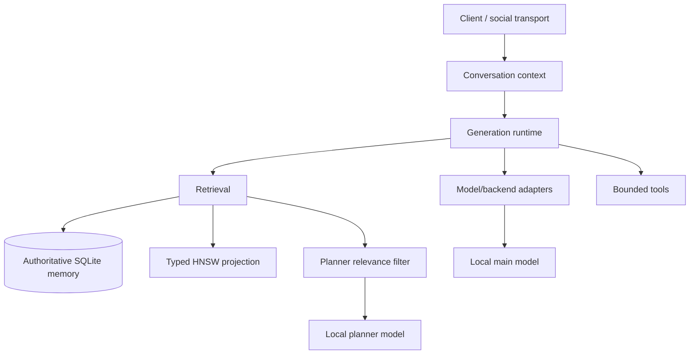

# Kven II

**Kven II is a local-AI research project about continuity: how to turn episodic language-model inference into a system that can preserve memory, context, relationships, unfinished intentions, and causal history across conversations and replaceable compute.**

This repository is a **selected public projection** of the working project. It contains representative product source, tests, and architecture notes, but deliberately excludes the private production/control plane, runtime state, credentials, host-specific configuration, and private engineering history.

Kven II does **not** claim that current language models are conscious. The engineering question is narrower:

> What architecture is required for a capable local model to behave as one continuing system rather than a sequence of isolated inference calls?

## What is technically distinctive

Kven II treats several problems that are often handled as unrelated features as parts of one continuity problem:

- **Unified durable memory.** Episodic and semantic memory remain authoritative in SQLite; vector search is a rebuildable projection rather than the source of truth.
- **Typed vector identity.** HNSW labels are mapped back to typed memory references so episodic and semantic rows cannot silently collide.
- **Explicit embedding-space contracts.** The accepted retrieval generation uses **Qwen3-Embedding-8B**, 4096-dimensional normalized embeddings, with distinct query/document roles.
- **Planner reranking.** Approximate vector recall is followed by a small-model relevance filter with a strict output protocol and fail-closed parsing.
- **Token-aware context ownership.** Conversation context is treated as system state to assemble and compact deliberately rather than as an accidental property of a UI.
- **Transport-independent person binding.** A transport identity can resolve to a semantic person without treating profile/owner metadata as proof of who is speaking now.
- **Model/backend adapters.** Backend-specific quirks are isolated behind adapters so model replacement does not leak compatibility logic through the application.
- **No-WAL SQLite invariant.** Kven-owned SQLite databases use `journal_mode=DELETE`; persistent `-wal` / `-shm` sidecars are intentionally excluded from the accepted architecture.
- **Bounded engineering.** Changes are measured, minimized, tested against explicit acceptance conditions, and stopped at the cheapest trustworthy failure boundary.

## Public architecture



The production system has additional transport, persistence, observability, and operational machinery. Those parts are intentionally not reproduced here when they would expose live control behavior without improving the technical value of the public project.

## Retrieval path

The public source preserves the important invariants of the accepted retrieval design:

1. durable memory rows live in SQLite;
2. document embeddings are generated in a versioned 4096-dimensional Qwen3 embedding space;
3. HNSW is a derived cache with a typed ID map and checksum binding;
4. query embeddings use an explicit retrieval instruction;
5. candidate recall is bounded;
6. a planner reranker rejects merely lexical or topical coincidences;
7. reranker protocol errors fail closed.

The point is not merely to add vector search. The system tries to preserve **which memory belongs to which subject and why it is relevant now**.

See [`docs/RETRIEVAL.md`](docs/RETRIEVAL.md).

## Context and continuity

Long conversations create a different failure mode from retrieval: useful history can exceed the model context even when it is stored durably. Kven II therefore separates:

- source conversation history;
- the active context assembled for a particular inference;
- compacted summaries/checkpoints;
- durable long-term memory.

The representative context module in this public projection demonstrates the boundary: keep recent dialogue verbatim, compact older dialogue under a token budget, and never treat compaction as deletion of the source history.

## Model adapters

The included adapter layer is taken from the working architecture. The Qwen/llama.cpp adapter demonstrates a concrete compatibility problem: some non-thinking streams can start with an empty `<think>...</think>` wrapper. The adapter suppresses only that exact empty leading wrapper and leaves malformed or non-empty reasoning markup untouched so the generic safety/continuation layer can reject it.

This is intentionally a narrow adapter rather than a model-specific branch scattered through the runtime.

## What has been measured

Kven II development uses measurement to choose architecture rather than treating model names as design decisions. The current retrieval generation was selected after bounded multilingual retrieval work comparing embedding behavior and retrieval roles. The accepted generation is based on Qwen3-Embedding-8B with 4096-dimensional normalized vectors plus planner reranking.

Storage behavior is also tested as an architectural property: Kven-owned SQLite connections are expected to remain in `DELETE` journal mode with no persistent WAL sidecars.

This public repository does not publish private benchmark corpora, runtime data, operational evidence packages, or private task history.

## Hardware and deployment stance

Kven II runs in a private local lab built around repurposed server hardware and NVIDIA datacenter GPUs. The system separates main-model and planner roles and uses llama.cpp-compatible local inference endpoints. Hardware limits are treated as engineering constraints: quantization, context size, model placement, retrieval depth, and routing are measured against the actual machine rather than designed for hypothetical cloud capacity.

Exact host addresses, administrative topology, service credentials, and private control paths are intentionally omitted.

## Engineering philosophy

Kven II uses a necessity-only rule:

> Nothing except what is strictly necessary to accomplish the task.

That means inspect before editing, measure before redesigning, prefer bounded changes, run relevant tests, avoid retry loops that only consume more compute, and treat rollback as state recovery rather than a refund of time, tokens, credits, or human attention.

See [`docs/ENGINEERING-METHOD.md`](docs/ENGINEERING-METHOD.md).

## Repository map

```text
src/kven_public/
  context_window.py            token-budgeted recent/older context boundary
  embedder.py                  Qwen3 4096-D embedding-space contract
  memory_store.py              SQLite memory schema with DELETE journaling
  memory_identity.py           typed episodic/semantic row identity
  provenance.py                compact versioned provenance envelopes
  person_binding.py            transport identity -> semantic person boundary
  index_rebuild.py             rebuild HNSW from authoritative SQLite
  index_lifecycle.py           index/map integrity validation
  planner_router.py            strict planner protocol client
  memory_reranker.py           fail-closed relevance reranking
  model_adapters/              backend compatibility boundary

tests/
  representative invariant tests

docs/
  architecture, retrieval, engineering and publication-boundary notes
```

## Deliberately not included

This public projection does **not** contain:

- credentials, tokens, keys, sessions, cookies, private endpoints, or environment files;
- memory databases, HNSW runtime state, logs, model weights, backups, or evidence packages;
- self-hosted runner entrypoints or unattended execution/control machinery;
- root/admin trust implementation;
- private mail/control-plane internals;
- production deployment contracts or host-specific service configuration;
- private Git history or internal task/handoff history;
- a workflow capable of operating the private lab.

The public repository is not an execution authority for the private Kven II system.

## Status

Kven II is an active research prototype. Interfaces and internal architecture can change as measurements invalidate assumptions.

This repository is intended for technical review and portfolio visibility, not as a production deployment bundle.

## License

**No open-source license is granted by this repository.** The absence of a `LICENSE` file is intentional.

## Author

Eugene Kuris
