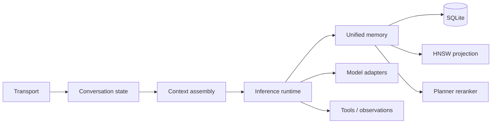

# Architecture

Kven II is organized around a distinction between **intelligence** and **continuity**.

A model call can provide intelligence for a moment. Continuity requires surrounding state that survives the call and remains causally connected to later calls.

## Functional layers

### Conversation state

Transport should not be the sole owner of history. Conversation state needs stable interlocutor/thread identity, ordered messages, restart-safe persistence, and a deliberate context-window policy.

### Unified memory

Different interlocutors do not imply different artificial personalities. The system uses one memory substrate with typed records, provenance, relationship-aware retrieval, and disclosure boundaries above storage.

SQLite is authoritative. Vector indexes are derived and rebuildable.

### Retrieval

The accepted retrieval generation uses Qwen3-Embedding-8B normalized 4096-dimensional vectors. A typed HNSW map prevents ambiguous integer IDs across episodic and semantic tables. Planner reranking filters approximate-neighbor candidates through a strict relevance protocol.

### Model boundary

Model and server choices are replaceable components. Backend-specific normalization belongs in adapters. This public tree includes a concrete Qwen/llama.cpp stream adapter.

### Persistent-state discipline

Kven-owned SQLite is intentionally non-WAL. `journal_mode=DELETE` is part of the accepted design rather than an incidental default.

## What this public projection is not

It is not the production topology. It omits live runner/control-plane entrypoints, host-specific deployment configuration, credentials, runtime state, and administrative trust mechanics. Those omissions do not change the architecture described above; they remove operational authority from the public surface.
