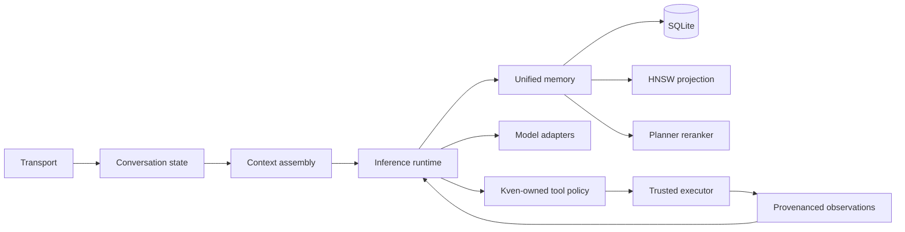

# Architecture

Kven II is organized around a distinction between **intelligence** and **continuity**.

A model call can provide intelligence for a moment. Continuity requires surrounding state that survives the call and remains causally connected to later calls.

## Functional layers

### Conversation state

Transport should not be the sole owner of history. Conversation state needs stable interlocutor/thread identity, ordered messages, restart-safe persistence, and a deliberate context-window policy.

### Unified memory

Different interlocutors do not imply different artificial personalities. The system uses one memory substrate with typed records, provenance, relationship-aware retrieval, and disclosure boundaries above storage.

SQLite is authoritative. Vector indexes are derived and rebuildable.

### Retrieval

The accepted retrieval generation uses Qwen3-Embedding-8B normalized 4096-dimensional vectors. A typed HNSW map prevents ambiguous integer IDs across episodic and semantic tables. Planner reranking filters approximate-neighbor candidates through a strict relevance protocol.

### Model boundary

Model and server choices are replaceable components. Backend-specific normalization belongs in adapters. This public tree includes a concrete Qwen/llama.cpp stream adapter.

### Tool ownership and continuation

Tool semantics belong to Kven, not to the model or client. Structured requests execute through a trusted boundary or fail closed; protocol-shaped client/model text is not evidence that execution occurred.

Continuations are bounded state transitions. The representative public path accepts a trusted web search, permits at most one fetch selected from its results, and then terminates in an ordinary semantic answer. It has no recursive browsing state. Current-time questions likewise depend on authoritative time execution and server-owned request-time grounding rather than client claims.

### Transports and durable identity

UI, social, and mail connections are transports around the same Kven-owned context, person/binding, memory, and retrieval state. A transport account identifier is durable routing evidence, not by itself authorization or a separate artificial personality. Private endpoints, concrete identities, ledgers, cursors, and session/control details are excluded here.

### Persistent-state discipline

Kven-owned SQLite is intentionally non-WAL. `journal_mode=DELETE` is part of the accepted design rather than an incidental default.

## What this public projection is not

It is not the production topology. It omits live runner/control-plane entrypoints, host-specific deployment configuration, credentials, runtime state, and administrative trust mechanics. Those omissions do not change the architecture described above; they remove operational authority from the public surface.
